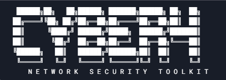

# CyberForge Network Security Toolkit

[](https://opensource.org/licenses/MIT)


Professional-grade network security assessment toolkit for ethical hacking and penetration testing.



## Features

### 🛠 Offensive Security Tools
- **Network Scanner** (Nmap integration with multiple profiles)
- **DDoS Framework** (Controlled UDP Flood with thread management)
- **ARP Spoofer** (Man-in-the-Middle attacks)
- **Evil Twin** (Rogue Access Point creation)
- **Port Knocker** (Stealth port sequence activation)

### 🔍 Reconnaissance & Analysis
- **Packet Sniffer** (PCAP capture/export)
- **Host Discovery** (Network enumeration with MAC identification)
- **Traffic Analysis** (Live pattern detection)
- **Vulnerability Scanner** (CVE detection using Nmap scripts)

### 🛡️ Defensive Utilities
- **MAC Randomizer** (Interface spoofing with validation)
- **Security Auditor** (Configuration vulnerability checks)
- **Resource Monitor** (Attack detection and alerting)
- **Session Encryptor** (Basic traffic obfuscation)

## ⚙️ Installation

### Requirements
- Linux OS (Kernel 4.4+ recommended)
- Python 3.7+
- Root privileges
- Wireless card supporting monitor mode (for radio features)

```bash
# Install system dependencies
sudo apt update && sudo apt install -y \
    nmap \
    hostapd \
    dnsmasq \
    aircrack-ng \
    iw \
    python3-pip \
    python3-scapy
'''
# Clone repository
git clone https://github.com/CipherX-bit/cyberforge-toolkit.git
cd cyberforge-toolkit

# Install Python packages
pip3 install -r requirements.txt
# Run Toolkit
python3 cyberforge.py